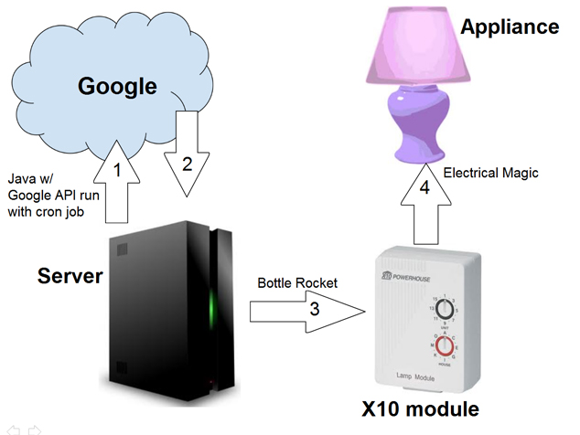

# Matt Huntington's Google Calendar Home Automation Project

## Overview

With the release of [Android @Home](http://www.wired.com/gadgetlab/2011/05/android-at-home-google-io/ "Android@Home"), it's increasingly obvious that big companies are finally getting behind home automation. But what if you want to control your appliances from anywhere in the world and not just from within your home with your phone? Here is system that I developed to allow you to do just that.

First, have a server running that has access to the Internet. I happened to have an Ubuntu server lying around, and this worked great. Next you'll want a way for the server to communicate with your appliances. The easiest thing for me was to buy this [X10 Kit](http://www.x10.com/automation/ck18a_s_ps32.html "X10"). Using the X10 computer interface, the server essentially sends signals to various modules around the house to turn on or off (its method of communication is over the power lines in your house). You can plug your appliances into these modules so that they turn on and off with the module.

Next you want a way to tell your sever to activate/deactivate certain appliances. For this I wrote a quick program on the server and created a cron job, telling the server to call my program periodically. The program used the [Google Calendar API](http://code.google.com/apis/calendar/ "Google Calendar API") to look at a calendar that I created specifically for home automation. It would then interpret the events in the calendar, and if applicable it would use a command line tool also on the server called [Bottle Rocket](http://www.linuxha.com/bottlerocket/ "Bottle Rocket") which would then communicate with the X10 computer interface.

The advantage to this process is that since Google Calendar is the link between you and your server/X10 setup at home, you can essentially write programs that also use the Google Calendar API or just use existing tools to communicate with your home setup. You can use the calendar on your smart phone, or you can use Google's calendar website. You can also share the calendar with anyone else with whom you live so that they can control your devices too.

http://www.youtube.com/v/7Zybw3Px1bQ

## Explanation

Here's a quick diagram of the process:  
  
To get this up and running, you'll have to do the following:

1.  [Purchase X10 Firecracker Kit](#purchase_x10)
2.  [Set up and test X10 Firecracker Kit](#setup_x10)
3.  [Set up the server](#server_setup)
4.  [Install BottleRocket](#install_bottlerocket)
5.  [Compile/Write Code](#code)
6.  [Create Cron Job](#cron_job)
7.  [Test Process](#test)

## Purchase X10 Firecracker Kit

[The X10 Firecracker Kit](http://www.x10.com/automation/ck18a_s_ps32.html "X10") is a pretty decent way to automate your home. It sends signals over your existing power lines so you don't have to run any wires, and it's also pretty reliable. When I initially started this project, I was thinking I would build my own devices using an adruino module connected to a blue-tooth transceiver chip. The arduino would receive commands via the blue-tooth module and then open an electronic relay, allowing power to flow through to the appliance. This is a perfectly valid approach, but my preference for the X10 kit comes simply from the fact the X10 did everything I wanted it to with no need to actually build anything myself.

The X10 kit that I bought was actually not available on the X10 site that I listed above. This is something to be careful of. X10 is not a great site as you can probably tell by its design. I actually made it all the way through the purchase process only to find out a few days later that the item was no longer in stock. I think it's been phased out because the [Firecracker Computer Interface](http://www.x10.com/products/firecracker_x10_cm17a_br1ab.htm) communicated over the serial port. I believe the current module that they have in stock runs over USB. At the time, I wasn't sure whether [Bottle Rocket](http://www.linuxha.com/bottlerocket/ "Bottle Rocket"), the command line program that I was planning to use to send signals to the X10 Computer Interface, would send its signals over the USB port. I ended up going on Ebay and purchasing the serial port Firecracker Module there. I now do believe that you can choose what port to send the commands over in BottleRocket, but I haven't messed around with it.

## Set Up Your X10 Firecracker Kit

The setup for the Firecracker is extremely easy. The first test to do is to plug the [Transceiver](http://www.x10.com/automation/tm751_s.html) into your wall. Plug an appliance into the transceiver and use the [remote](http://www.x10.com/automation/hr12a_s.html) to turn on the appliance. Both the transceiver and the [lamp module](http://www.x10wirelesshome.com/modules/x10_lamp_module_lm465.html) have two settings that you can adjust: house and unit. I guess the house setting is if you own an apartment building or maybe just have multiple buildings (say a garage or guest house) as part of your home. You can change these settings on your transceiver with a screw driver. If you haven't changed the settings, then the appliance you plugged into the transceiver can be activated by pressing the on button on the first row which corresponds to unit one. If you have changed the settings on the transceiver then be sure to adjust the settings on the remote as well and push the correct button.

## Set Up the Server

There's a decent amount of flexibility in how you set up your server. If you want to use Bottle Rocket the way I did, you have to use a Linux server. Just set up any flavor of linux (I used Ubuntu) and make sure it has connection to the internet and can run/compile java (assuming you're going to use my code).

## Install BottleRocket

For me this was pretty easy since I was using Ubuntu: `apt-get install bottlerocket`. If you're don't have some kind of package manager, the bottle rocket site has lots of different [downloads](http://www.linuxha.com/bottlerocket/#downloading).

## Compile/Write Code

This was probably the lengthiest part of the process for me. If you take [this code](https://github.com/mahuntington/Home-Automation), it will be really quick. Here's a fairly in depth explanation:

### HomeAutomation.java

```java
    import java.io.FileInputStream;
    import java.util.Properties;

    import com.matthewhuntington.homeautomation.*;

    public class HomeAutomation
    {

    	/**
    	 * @param args
    	 */
    	public static void main(String[] args)
    	{
    		Properties properties = new Properties();
    		try
    		{
    			properties.load(new FileInputStream("login.properties"));
    			CalendarParser parser = new CalendarParser(properties.getProperty("calendar"), properties.getProperty("user"), properties.getProperty("pass"));
    			ActionExecutor executor = new ActionExecutor(parser.getActions());
    			executor.executeAll();
    		}
    		catch (Exception e)
    		{
    			System.out.println("Could not load properties file.");
    		}
    	}
    }			
```

Here's the main file. This starts off by loading the properties file which will have values for which calendar to use and the user/password used to authenticate. The `login.properties` file should look something like this (and should eventually be stored in the same dir as the compiled code):

    user = foo.bar@gmail.com
    pass = p@55w0rd
    calendar = alphanumbericstring1234%40group.calendar.google.com

The first two values will be your Google account info. The last one is the calendar id. You can get this by opening up the Google Calendar web page. On the left is a list of calendars under the title "My calendars." Select the dropdown next to the calendar that you want to use for home automation and click "Calendar Settings." There's a section called "Embed This Calendar" towards the bottom of the new page. You'll see a textarea field with some html code for an iframe. Look for the GET parameter called `src` and copy its value. This is your calendar's ID.

Once the properties have been loaded, the `main` function creates a `CalendarParser` object (explained below) using the values retrieved from the properties file. Once created, the `CalendarParser` object contains an `ArrayList` of `Action` objects which are essentially instructions for the linux server (explained below). After creating the `CalendarParser` object, the `main` function creates an `ActionExecutor` and passes in the `CalendarParser`'s actions list as a parameter. Finally, the `main` function tells the `ActionExecutor` object to execute its actions.

### CalendarParser

```java
    package com.matthewhuntington.homeautomation;

    import java.net.URL;
    import java.util.ArrayList;
    import java.util.Date;
    import java.util.List;

    import com.google.gdata.client.calendar.CalendarQuery;
    import com.google.gdata.client.calendar.CalendarService;
    import com.google.gdata.data.calendar.CalendarEventEntry;
    import com.google.gdata.data.calendar.CalendarEventFeed;
    import com.google.gdata.data.extensions.When;

    public class CalendarParser
    {
    	protected ArrayList<Action> actions = new ArrayList<Action>();

    	public CalendarParser(String id, String user, String password)
    	{
    		CalendarService myService = new CalendarService("Home Automation");
    		URL feedUrl = null;
    		CalendarEventFeed resultFeed = null;
    		try
    		{
    			feedUrl = new URL("https://www.google.com/calendar/feeds/" + id + "/private/full");
    			CalendarQuery myQuery = new CalendarQuery(feedUrl);
    			myService.setUserCredentials(user, password);
    			resultFeed = myService.query(myQuery, CalendarEventFeed.class);
    		}
    		catch (Exception e)
    		{
    			System.out.println("Could not get Calendar data from Google.");
    			e.printStackTrace();
    			return;
    		}

    		Date now = new Date();

    		for (int i = 0; i < resultFeed.getEntries().size(); i++)
    		{
    			CalendarEventEntry entry = resultFeed.getEntries().get(i);
    			List<When> times = entry.getTimes();
    			for (int j = 0; j < times.size(); j++)
    			{
    				Date start = new Date(times.get(j).getStartTime().getValue());
    				Date end = new Date(times.get(j).getEndTime().getValue());
    				if (now.after(start) && now.before(end))
    				{
    					String command = entry.getTitle().getPlainText();
    					char house = command.charAt(0);
    					if (command.length() > 1)
    					{
    						int socket = Integer.parseInt(command.substring(1));
    						Action new_action = new Action(house, socket, 1);
    						actions.add( new_action );
    					}
    					else
    					{
    						actions.add( new Action(house, 1));
    					}
    				}

    			}
    		}
    	}

    	public ArrayList<Action> getActions()
    	{
    		return actions;
    	}
    }
```

The calendar parser is a little more involved. I'm using the [Google Data Java Client Library](http://code.google.com/apis/gdata/articles/java_client_lib.html) to deal with converting Google's XML services to java objects. Basically everything before the large `for` block gets the calendar data from Google. The first `for` block goes through and gets the events for this calendar. An event can have multiple start/top times associated with it (e.g. if it's repeated weekly), so the next `for` block goes through each pair of start/stop times associated with an event to see if that event should be evaluated. It does this by checking if the start time is before the current system time and if the end time is after the current system time. Because the program uses system time, you'll have to make sure that the system time on your server is in sync with Google's time.

### Action.java

```java
    package com.matthewhuntington.homeautomation;

    public class Action
    {
    	protected int socket;
    	protected char house;
    	protected boolean apply_to_all_sockets;
    	protected int value;

    	public Action(char house, int value)
    	{
    		this.house=house;
    		this.apply_to_all_sockets=true;
    		this.value=value;
    	}

    	public Action(char house, int socket, int value)
    	{
    		this.house=house;
    		this.socket=socket;
    		this.apply_to_all_sockets=false;
    		this.value=value;
    	}

    	public int getSocket()
    	{
    		return socket;
    	}

    	public char getHouse()
    	{
    		return house;
    	}

    	public boolean getApplyToAllSockets()
    	{
    		return apply_to_all_sockets;
    	}

    	public int getValue()
    	{
    		return value;
    	}
    }		
```

The `Action` class is very simple. Its objects act as a form of communication between the `CalendarParser` and the `ActionExecutor`. The `CalendarParser` knows how to create them, and the `ActionExecutor` knows how to interpret them.

The class consists of a few members (which are set in the constructor) and their get methods. The `socket` variable is corresponds to the "unit" setting on the lamp/transceiver modules. The `house` setting is the same as that on the lamp/transceiver modules. The `apply_to_all_sockets` just says whether the action should be applied to a specific socket or all sockets in the house. `value` is either `0` or `1` depending on whether the command is to turn off or on repectively.

### ActionExecutor.java

```java
    package com.matthewhuntington.homeautomation;

    import java.util.ArrayList;

    public class ActionExecutor
    {
    	protected ArrayList<Action> actions;
    	protected static final String program_name = "br";
    	protected static final String port_param = "--port=";
    	protected static final String house_param = "--house=";
    	protected static final String on_param = "--on=";
    	protected static final String off_param = "--off=";
    	protected static final String on = "--ON";
    	protected static final String off = "--OFF";

    	protected static final String default_port = "/dev/ttyS0";
    	protected static final String default_command_start = program_name + " " + port_param + default_port + " " + house_param;

    	public ActionExecutor(ArrayList<Action> actions)
    	{
    		this.actions = actions;
    	}

    	protected void call(String command)
    	{
    		try
    		{
    			Runtime.getRuntime().exec(command);
    			//System.out.println(command);
    		}
    		catch(Exception e)
    		{
    			System.out.println("Could not execute runtime command");
    			e.printStackTrace();
    		}
    	}

    	public void activate(char house, int socket)
    	{
    		String command = default_command_start + house + " " + on_param + socket;
    		call(command);
    	}

    	public void activate(char house)
    	{
    		String command = default_command_start + house + " " + on;
    		call(command);
    	}

    	public void deactivate(char house, int socket)
    	{
    		String command = default_command_start + house + " " + off_param + socket;
    		call(command);
    	}

    	public void deactivate(char house)
    	{
    		String command = default_command_start + house + " " + off;
    		call(command);
    	}

    	public void execute(Action action)
    	{
    		if(action.getApplyToAllSockets())
    		{
    			if(action.getValue()==1)
    				activate(action.getHouse());
    			else if(action.getValue()==0)
    				deactivate(action.getHouse());
    		}
    		else
    		{
    			if(action.getValue()==1)
    				activate(action.getHouse(), action.getSocket());
    			else if(action.getValue()==0)
    				deactivate(action.getHouse(), action.getSocket());
    		}
    	}

    	public void executeAll()
    	{
    		for(int i=0; i<actions.size(); i++)
    		{
    			execute(actions.get(i));
    		}
    	}
    }
```

This last class is much simpler than it appears. Basically all it does is just format a string and then in `protected void call(String command)` it executes `Runtime.getRuntime().exec(command);` on that string. Almost all of the other functions and members serve only to make the formatting process more clear and extendable. The `public void execute(Action action)` function takes an action and based on its values calls the appropriate function which begins the formatting process. This second function then calls the `protected void call(String command)` function.

### Compilation

There are a couple ways to compile this java code, but I'd suggest making it an executable jar with no external dependancies (except for of course the login.properties file). It just makes deployment and the creation of the cron job that much easier in my mind.

## Create a Cron Job

Now that you've created your java program, you'll want to have it executed periodically. To do this, create a cron job on your linux server by executing the following command: `sudo crontab -e`. This will open up an editor where you can add the following line (or something similar) at the bottom:

`*/5 * * * * java -jar /usr/bin/homeautomation.jar >> /var/log/homeautomation.log`

Note that I've redirected all the output to a log file that I've created for the process.

## Test the Process

Now you've completed your setup and are ready to test it. Log on to your Google Calendar and create an event in the calendar that you specified in the properties file. Remember that the title of the event must only be of the form House[Unit] (e.g. A2, B3, C, D4, etc). Remember that the time at which this executes will only be as accurate as you set it to be in your cron job. If you have problems, make sure your server's system clock is accurate. If it works, congrats! If you have a smart phone that syncs with your google calendar, try that. Try sharing your calendar with a housemate or maybe using the google API to write more programs for whatever device you want. One thing to note is that X10 sells a wide variety of products including HVAC automation. I haven't tried it yet, but I get the feeling that you can use this same process to control your heating, air-conditioning, etc.

Enjoy!
